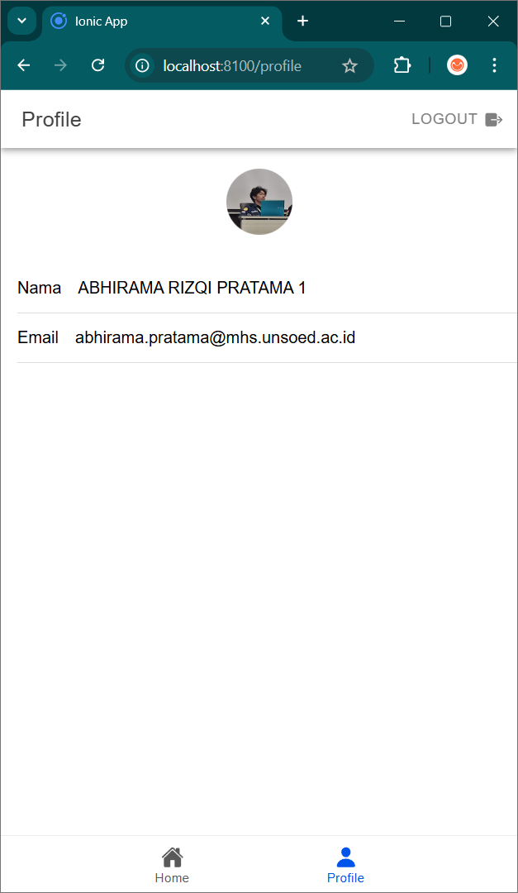

# Vue Firebase Authentication
 
Nama        : Abhirama Rizqi Pratama  
Nim         : H1D022099  
Shift Lama  : D  
Shift Baru  : A 
 
## Langkah-langkah Implementasi

### 1. Inisialisasi Firebase
Inisialisasi Firebase dengan konfigurasi yang sesuai di `src/utils/firebase.ts`:
- Konfigurasi Firebase SDK
- Inisialisasi aplikasi Firebase
- Setup layanan autentikasi

### 2. Membuat Store untuk Autentikasi
Buat store menggunakan Pinia di `src/stores/auth.ts` untuk:
- Mengelola status autentikasi pengguna
- Menyimpan data user
- Menangani proses login/logout

### 3. Implementasi Login Component
Implementasikan fitur login di `src/views/LoginPage.vue`:
- Tambahkan tombol login Google
- Hubungkan dengan fungsi `loginWithGoogle`
- Tangani callback setelah login berhasil

### 4. Menampilkan Data Pengguna
Akses dan tampilkan data pengguna di `src/views/ProfilePage.vue`:
- Username
- Foto profil
- Informasi akun lainnya

## Catatan Penting
⚠️ Pastikan untuk mengganti `YOUR_CLIENT_ID` dengan ID klien Google yang valid dari project Firebase Anda.

## Teknologi yang Digunakan
- Vue.js
- Firebase Authentication
- Pinia State Management
- TypeScript

# Screenshot

  
  
  
  

